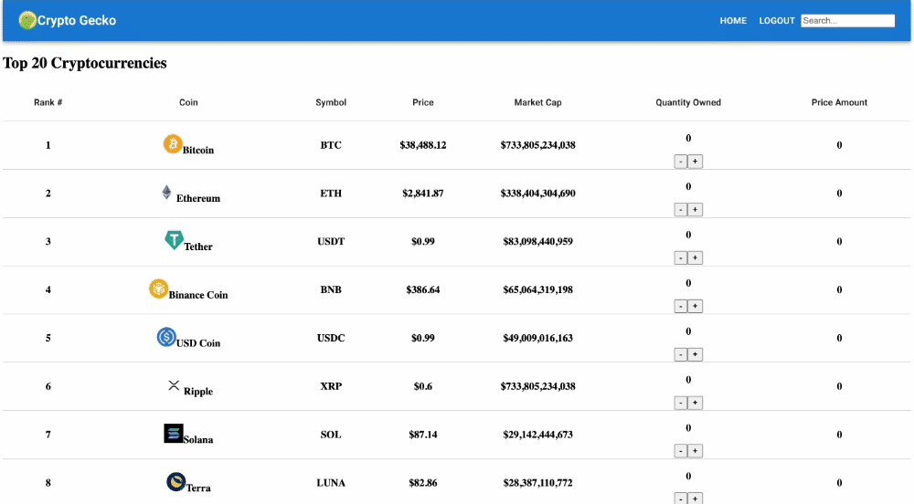
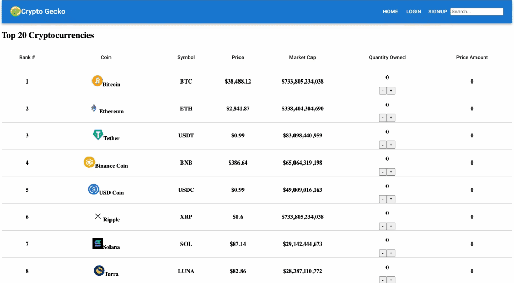

# Crypto Tracker

# Overview

Here is a React application that mimics a crypto tracker due to my strong passion for cryptocurrency! I would love to work more within this space and anything that has to do with blockchain and Web3. I hope you enjoy! :)

# Requirements 

* Uses Node version 16.11.1.
* Uses npm version 8.6.0.
* Must install json-server.
* Single Page Application (only one index.html file) using create-react-app.
* 5 components minimum to keep code organized. 
* At least 3 client-side routes using [React Router](https://reactrouter.com/).
* Use a json-server to create a RESTful API for your backend and make both a GET and a POST request to the json server. Use a form to make your post request, specifically a controlled form/component. Additionally, you may choose to incorporate data from an external API but it is not required.
* Add some CSS styling. Either create styling from scratch and/or incorporate a UI framework (like [React Bootstrap](https://react-bootstrap.github.io/),[Semantic UI](https://react.semantic-ui.com/), or [Material UI](https://mui.com/)).

# Installation

* Fork and clone repo
* Open project, run npm install (if you used npx)
* Run npm start 

# Features 

* Navigation (Navbar)
* Contains Home Page which lists the top 20 cryptocurrencies 
* Sign up page which lets you create an account 
    * If account exists already, you will be notified
* Login page
    * If account username and/or password is incorrectly typed, you will be notified 
* Search Bar that matches the crypto typed in 
* Change in crypto quantity and price amount when plus or minus button is clicked  

# How to use 

Sign up for an account! You will be alerted if you have an existing account. 

If you have an account, use the login page!

Here is the home page. You will be able to add and subtract the crypto you own along with the price amount!

The search bar will filter out the cryptos you would only like to see!

# Technologies used 

This web app was made with:

* HTML
* CSS
* Javascript
* React Library
* JSON-SERVER to create RESTful API 

# Conclusion 

Learning React was thoroughly challenging, yet very rewarding once I started to get the hang of it. I look forward to learning more as I get further into my flatiron curriculum and learn backend next. I plan to continue adding to this project as crypto is a passion of mine!
